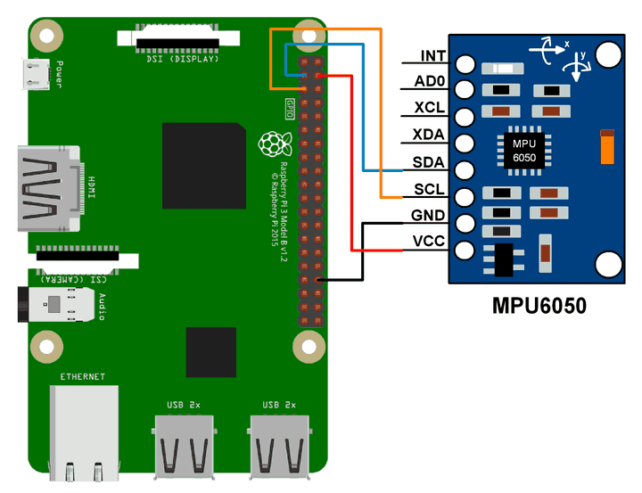
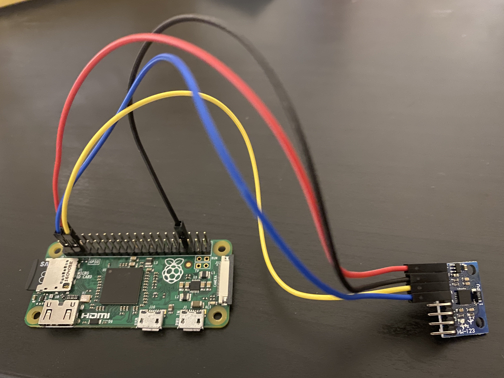

# Brain Box Hat

* [Hardware](#Hardware)
* [MPU6050](#MPU6050)
* [Reference](#Reference)

Documentation on how to build Brain Box Hat, a waearable hat with a screen and MPU6050 sensor interacting with Three.js.

## Hardware

* Raspberry Pi Zero
* MPU6050
* Pimoroni Display HAT Mini

## MPU6050

### Setup




### Test Code

Install required module:
```pip install mpu6050-raspberrypi```

Test python file:

```
from mpu6050 import mpu6050
import time
mpu = mpu6050(0x68)

while True:
    print("Temp : "+str(mpu.get_temp()))
    print()

    accel_data = mpu.get_accel_data()
    print("Acc X : "+str(accel_data['x']))
    print("Acc Y : "+str(accel_data['y']))
    print("Acc Z : "+str(accel_data['z']))
    print()

    gyro_data = mpu.get_gyro_data()
    print("Gyro X : "+str(gyro_data['x']))
    print("Gyro Y : "+str(gyro_data['y']))
    print("Gyro Z : "+str(gyro_data['z']))
    print()
    print("-------------------------------")
    time.sleep(1)
```

### Errors

```
i2cbus = smbus.SMBus(1)
FileNotFoundError: [Errno 2] No such file or directory
```
To fix this error enable the I2C interface with the Raspberry Pi config utility.

1. ```sudo raspi-config```
2. Select Interfacing options
3. Choose I2C 
4. Hit Enter
5. Select Finish

## Reference

* [Electronic Wings MPU6050 Guides](https://www.electronicwings.com/raspberry-pi/mpu6050-accelerometergyroscope-interfacing-with-raspberry-pi)
* [MPU6050 With Raspberry Pi](https://github.com/Arijit1080/mpu6050-with-Raspberry-Pi)
* [Pimoroni Display HAT Mini Guides](https://shop.pimoroni.com/products/display-hat-mini)
